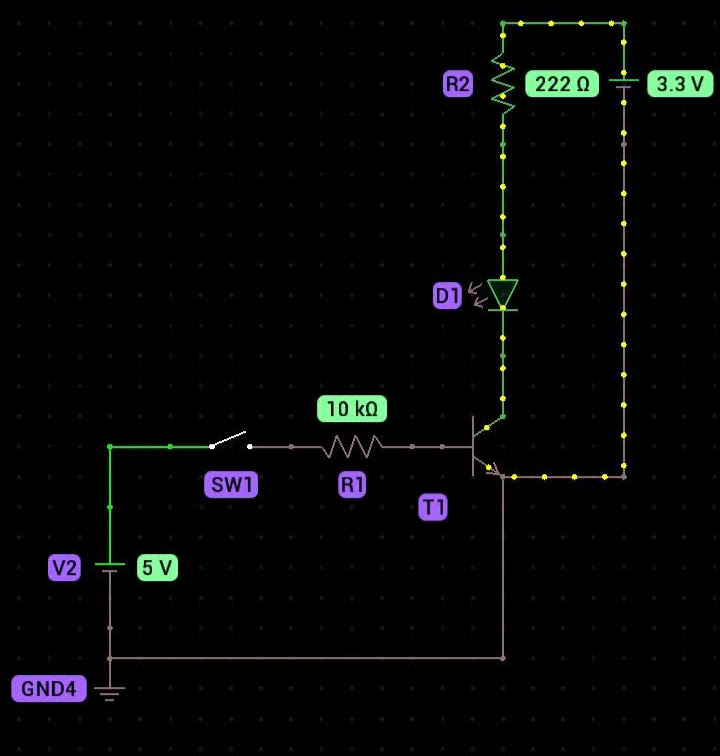

# Super Bot - with bot

A Telegram Bot that controls IOT devices on a Raspberry Pi Zero W and brings API data to the chat.

background:
This project was first developed to monitor a server room's temperature using telegram bot to receive the values.
As the time didn't help at that moment, I didn't finish the project.
But now let's go.

Today it's a bot with multi-functions and programmable to receive more functions. 

Materials:

1. Any Raspberry Pi - I'm using Raspberry Pi Zero W on [headless](https://vorthkor.github.io/victao-blog/learn/2021/12/10/headlessraspi.html)
2. DHT11 temperature and humidity sensor
3. BC548 Transistor
4. 10k Ohms Resistor
5. 5VDC Relay module - 110/220VCC
6. Telegram bot API token
  * Create with `@BotFather` on Telegram and it will give you the bot token
  * Enable inline commands and make the ones you want

## Build system

Run `pinout` on raspberry's terminal to see which pin to connect - see [map
of the GPIO](docs/gpio.md) to see the connections.

Install pip `sudo apt install python3-pip`

Run `pip3 install Adafruit_DHT` - Adafruit's DHT package.

Run `pip3 install telepot` - Telepot's package.

Run `pip3 install python-dotenv` - Pyhton's dot env package.

Using the raspberry pi on headless setup, run `bash -c "python3 tempsense/tempsense/app.py" & disown -ah && exit` on terminal to let the bot running.

OR

Run `python3 tempsense/tempsense/app.py`

Now just chat with the bot or add it on a group or channel. Functions below!

I'm leaving the other files to further study, so just ignore them - or don't.

Soon more info.

## Bot commands 

- /temperature - Verifies the room's temperature 🌡
- /lumiere - Allumer la lampe 💡
- /led - Accendere il LED 🔦
- /naozhong - Dǎkāi nàozhōng ⏰
- /fala - Conversas aletórias 🗣️
- /miseru - 写真を見せる 📸
- /dailyinfo - Info about the mars or astronomy picture of the day 📝
- /astronomydaily - The astronomy picture of the day 🔭
- /marsdaily - The latest mars picture 🚀
- /listagem - Listagem de los comandos disponibles 📜
- /whoami - 🗣️

## Circuit

This is the transistor BC548 used to toggle 3v3 to the input of the relay.

## What's new

### 2023-09-20

- Add dot env file - pass the token and chat ID there
- Add alarms functions
- Add new temperature function based on time

### 2022-06-28

- New component -> relay (inside messages module).
- Now you can control something through a command in Telegram, like a lamp, some system, etc.
- In the way to do some IOT smart thing whatever.

### 2021-11-02

- New script with Telegram bot. Interact with a bot to get temperature and humidity values.

## References

- [Raspberry GPIO pinout][rp]
- [ASCII art with python][ap]
- [Documentation learnt from @mislav poignant-guide repo][dm]
- [Markdown mastering][mm]
- [ADAFRUIT-DHT install][ai]
- [ADAFRUIT-DHT python install][dp]
- [DHT on adafruit example][da]
- [DHT on adafruit examples 2][dt]
- [Telepot documentation][td]
- [File manager with python][pl]
- [Dot env documentation][dd]

* * *

> WARNING: I don't know why, but if you add the bot already running in a group, the code AND the bot cracks, and it stops working forever, I lost like 4 bots doing that. If you know why please contact me or send and issue or PR i dunno. Thanks a lot!

  [rp]: https://www.raspberrypi.com/documentation/computers/os.html#gpio-and-the-40-pin-header
  [ap]: https://stackoverflow.com/questions/23623288/print-full-ascii-art
  [dm]: https://github.com/mislav/poignant-guide
  [mm]: https://guides.github.com/features/mastering-markdown/
  [ai]: https://pypi.org/project/Adafruit-DHT/
  [dp]: https://pypi.org/project/Adafruit_Python_DHT/
  [da]: https://circuitpython.readthedocs.io/projects/dht/en/latest/examples.html
  [dt]: https://www.programcreek.com/python/example/92775/Adafruit_DHT.DHT11
  [td]: https://telepot.readthedocs.io/en/latest/
  [pl]: https://docs.python.org/3/tutorial/inputoutput.html
  [dd]: https://saurabh-kumar.com/python-dotenv/
